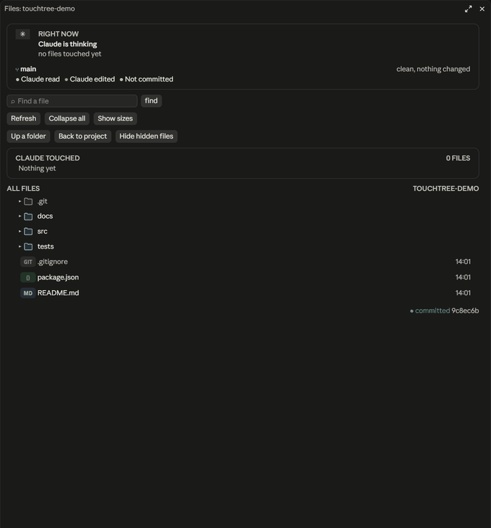
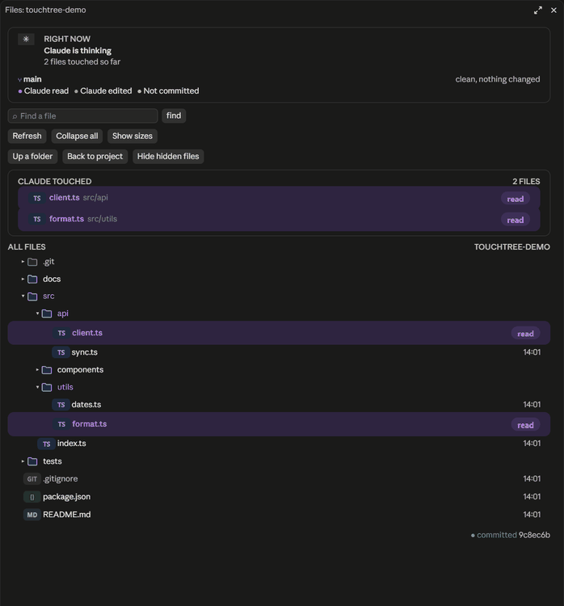
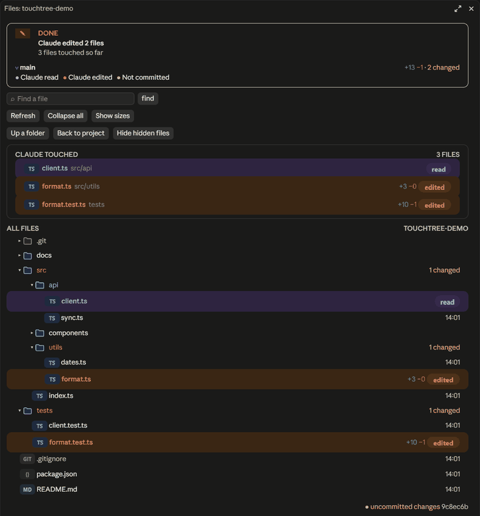
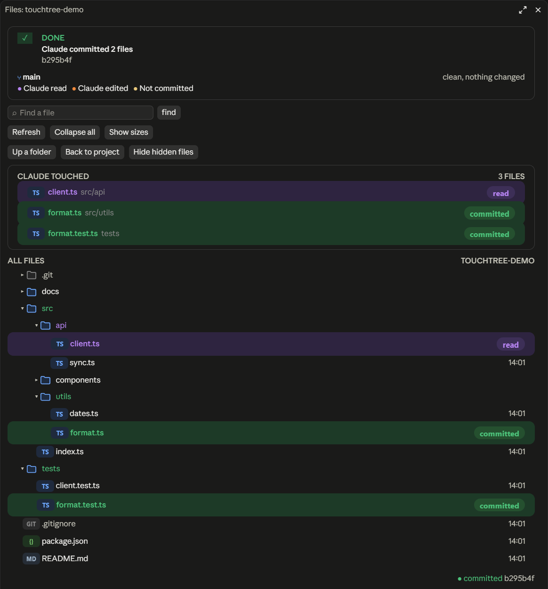

<h1 align="center">touchtree</h1>

<p align="center">
  A Files pane for the <b>Claude Code desktop app</b> that shows, live, which files Claude reads, edits and commits, right in your project tree.
</p>

<p align="center">
  
  
  
  
</p>

<p align="center">
  
</p>

> [!IMPORTANT]
> touchtree is built for the **Claude Code desktop app** (the Code tab). It has not been tested in the terminal `claude` CLI, and the pane is not expected to display there.

---

## Installation

touchtree's repository is its own plugin marketplace. In a Claude Code session in the desktop app, run:

```text
/plugin marketplace add ItsJustLeo22/touchtree
/plugin install touchtree@touchtree
```

The pane opens on its own at the start of each session. If you close it, bring it back with:

```text
/touchtree
```

## Features

### See what Claude reads

Files Claude reads light up purple with a `read` pill. Folders open on their own to reveal the file, and their names shimmer while Claude works inside them.

<p align="center">
  
</p>

### See what Claude edits

Edited files turn orange with an `edited` pill and the exact lines added and removed. Folders show how many files changed inside them, and the status card sums it up: "Claude edited 2 files".

<p align="center">
  
</p>

### See what Claude commits

When Claude runs `git commit`, every file in the commit turns green, and the card shows the commit hash.

<p align="center">
  
</p>

### And more

- **Status card:** what Claude is doing right now ("Claude is editing `format.ts`"), or what it did last turn, with your branch, commits ahead, and lines changed.
- **Claude touched:** a running list of every file Claude read or edited this session.
- **Folder colours:** a folder takes the colour of the strongest action inside it: committed, then edited, then read.
- **Shell changes count too:** files Claude creates or changes through shell commands show as edits, not only those changed with its file tools.
- **Tools:** find a file by name, collapse all, show sizes, hide hidden files, and move up a folder or back to the project.

<p align="center">
  
</p>

## Colours

| Colour | Meaning |
| --- | --- |
| Purple | Claude read the file |
| Orange | Claude edited the file |
| Green | The file was committed |
| Yellow | Uncommitted changes Claude didn't make |

## Requirements

- The Claude Code desktop app, with a Claude Code engine that supports plugin hooks (tested with 2.1.293).
- `git` on your `PATH` for branch, change and commit information. Without git the tree still works.
- Tested on Windows.

## Privacy

touchtree runs entirely on your machine. It lists folders in your project and runs read-only git commands (`status`, `diff`, `rev-parse`, `ls-files`). It makes no network requests and sends nothing anywhere. The touched-files list is kept for the current session only.

## Known limits

- In a brand-new folder that git doesn't track yet, files show as new without line counts.
- The change totals on the status card cover the whole git repository, not only the open folder.
- The tree shows up to 400 rows; collapse folders or use search for larger projects.
- The touched-files list resets when the desktop app restarts.

## Acknowledgements

The read, edit and commit colour scheme and the shimmer follow the style of [claude-code-filetree](https://github.com/data-goblin/claude-code-filetree), a terminal file tree for Claude Code.

## License

[MIT](LICENSE)
